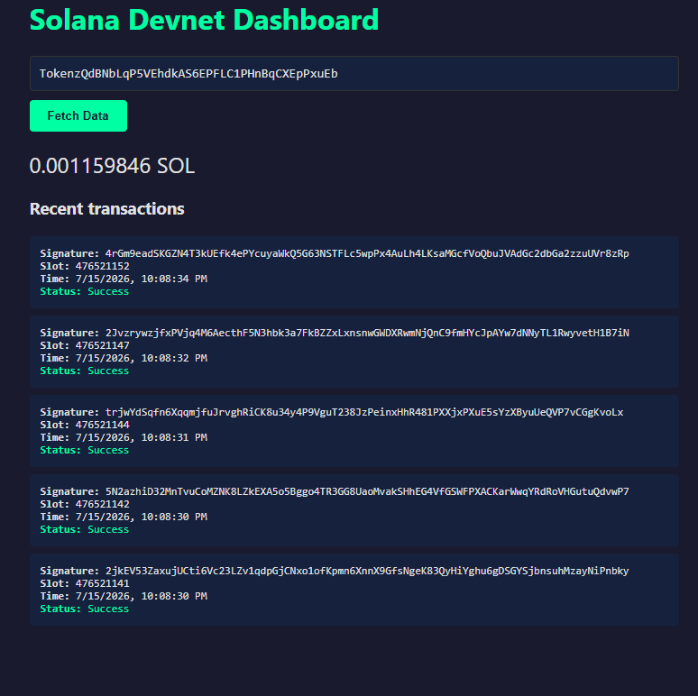

## Screenshot



## Overview

This project is part of my **#100DaysOfSolana** challenge.

I built a browser-based dashboard that connects to the Solana Devnet and displays the SOL balance and the five most recent transactions for any valid Solana address.

## Features

- Fetch SOL balance
- Fetch the five most recent transactions
- Display transaction status
- Convert Unix timestamps into readable dates
- Handle invalid addresses gracefully

## Technologies

- JavaScript
- Vite
- @solana/kit
- Solana RPC
- HTML
- CSS

## What I Learned

- How frontend applications communicate with Solana RPC nodes.
- The difference between terminal scripts and browser applications.
- How JavaScript dynamically updates HTML content.
- How to build my first Web3 dashboard.

## Run Locally

```bash
npm install
npm run dev
```

Then open:

```
http://localhost:5173
```
